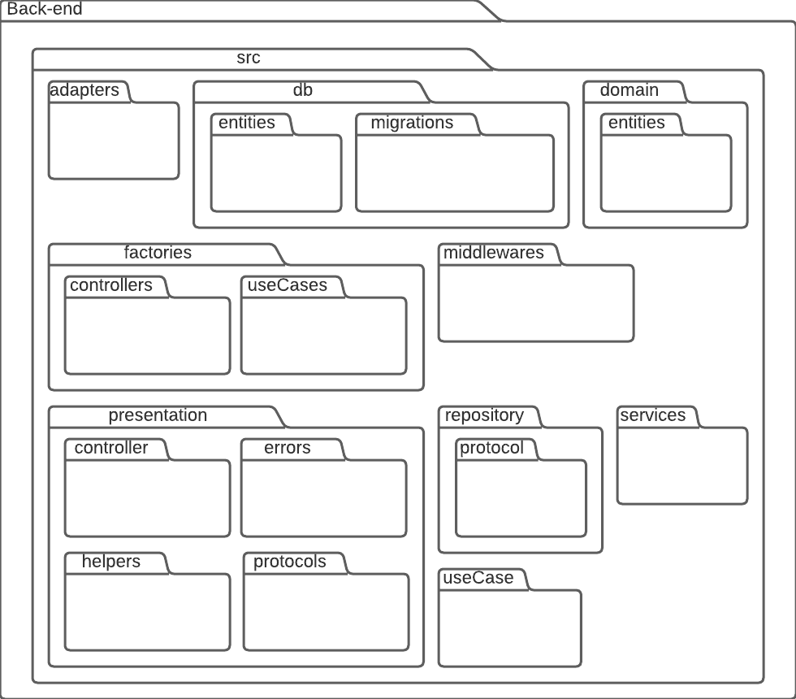

# Documento de Arquitetura

## 1. Introdução
Este documento tem como principal objetivo elucidar as principais caracteristicas da arquitetura proposta para o software Alectrion, utilizando diferentes visões arquiteturais para destacar diferentes aspectos do sistema, trazendo uma visão geral de toda a arquitetura do sistema. Deste modo facilitando a entendimento da arquiterua para os desenvolvedores.

### 1.1. Visão Geral
Este documento está estruturado da seguinte forma:
- Introdução
- Representação arquitetural
- Visão lógica
- Visão de dados
- Referências bibliográficas
- Histórico de versão

## 2. Representação arquitetural
### 2.1. Diagrama de relações

O estilo arquitetural de microsserviços consiste em uma abordagem arquitetural a qual uma aplicação é composta por serviços menores, que são implementados de forma independente com acomplamento fraco. Esses serviços independente podem, normalmente, se comunicar entre si utilizando de APIs e são organizados por recurso de negócios.
  
A arquitetura de microsserviços acelera o desenvolvimento e também facilita a escalabilidade de uma aplicação. Este padrão arquitetural será utilizado no Electrion. O padrão de base de dados por serviço também será utilizada, onde cada microsserviço possuíra uma base de dados independente.

### 2.2. Representação dos serviços
#### 2.2.1. Gateway
O gateway é responsável para realizar a interface do usuário com os demais serviços da aplicação, provendo autenticação e autorização.

#### 2.2.2. Usuário
O serviço de usuário é responsável por gerenciar os usuários da aplicação.

#### 2.2.3. Equipamento
O serviço de equipamento é responsável por gerenciar os equipamentos da aplicação, bem como ordens de serviço e movimentações.

#### 2.2.4. Front-end
O front-end é a interface pela qual o usuário irá interagir com a aplicação.

### 2.3. Tecnologias
#### 2.3.1. React
O React consiste em uma biblioteca JavaScript para desenvolvimento de interfaces de usuário baseada em componentes, permitindo a criação de componentes encapsulados que gerenciam seu próprio estado que, quando combinanos, possibilitam a criação de UIs complexas. O React será utilizado no front-end.

#### 2.3.2. Node.js
O Node.js é uma plataforma de aplicação para JavaScript com o objetivo principal de facilitar a construção de aplicações escaláveis. O Node.js é geralmente utilizado no lado do servidor e é orientado para o estilo de programação voltada a evento, sendo leve, eficiente e uma boa alternativa para arquitetura de microsserviços. O Node.js será utilizado em todos os serviços do back-end.

#### 2.3.3. PostgreSQL
O PostgreSQL é um sistema gerenciador de banco de dados relacionais de código aberto. O PostgreSQL será utilizado para gerenciar as bases de dados dos serviços da aplicação.

## 3. Visão lógica
### 3.1. Diagrama de pacotes

### 3.2. Diagrama de implantação

### 3.3. Diagrama de classe
#### 3.3.1. Microsserviço de usuário

#### 3.3.2. Microsserviço de equipamentos

## 4. Visão de dados
### 4.1. Diagrama lógico

## 5. Referências Bibliográficas

> [1] EQUIPE ALECTRION 2022-2. Documento de Arquitetura. Disponível em: https://fga-eps-mds.github.io/2022-2-Alectrion-DOC/#/./Documentos/arquitetura

> [2] SOARES, João Pedro; ESTANISLAU, Matheus. Documento de Arquitetura. Disponível em: https://fga-eps-mds.github.io/2022-1-Alectrion-DOC/documentation/Documentos/documento-arquitetura.html. Acesso em: 8 dez. 2022.

> [3] PATROCÍNIO, Sofia; GOUVEIA, Micaella; PEREIRA, Samuel; TAIRA, Luis Henrique; MUNIZ, Amanda. Chatbot Gaia: Documento de Arquitetura. Disponível em: https://fga-eps-mds.github.io/2019.1-Gaia/#/projeto/DocArquitetura. Acesso em: 8 dez. 2022.

> [4] RICHARDSON, Chris. Database per service. Disponível em: https://microservices.io/patterns/data/database-per-service.html. Acesso em: 8 dez. 2022.

> [5] CREATELY. O Guia Fácil de Diagramas de Implantação UML. Disponível em: https://creately.com/blog/pt/diagrama/tutorial-do-diagrama-de-implantacao. Acesso em: 11 dez. 2022.

## 6. Histórico de versão

|**Data**|**Descrição**|**Autore(es)**|
|--------|-------------|--------------|
| 17/05/2023 | Adição do documento | João Vitor |
