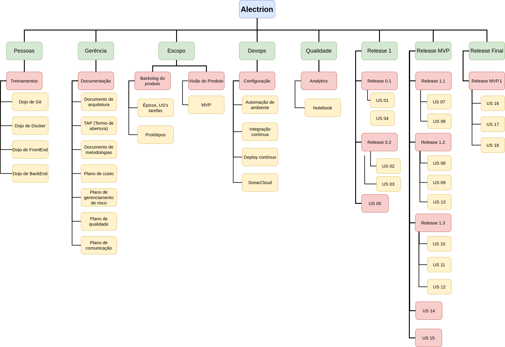

# Estrutura Analítica do Projeto (EAP)

## 1. Introdução

Conforme descrito no Guia PMBOK, a EAP pode ser compreendida como uma decomposição do escopo total do trabalho a ser realizado pela equipe do projeto visando alcançar os objetivos do projeto e realizar entregas requisitadas. Desta forma, a EAP organiza e define o escopo total do projeto aprovado.

Na EAP o trabalho planejado é contido no nível mais baixo de componente, denominados pacotes de trabalho. Um pacote de trabalho pode ser usado para agrupar as atividades onde o trabalho é agendado, estimado, monitorado e controlado. No contexto da EAP, o trabalho se refere às entregas que são resultados da atividade.

## 2. EAP

A imagem 1 abaixo mostra a EAP para o projeto Alectrion.

## 3. Referências Bibliográficas

<!-- Referências enumeradas-->

> [1] Guia PMBOK 6a. ed. EUA: Project Management Institure, 2017. Disponível em: http://www.sesp.mt.gov.br/documents/4713378/12273418/Guia-PMBOK+6%C2%AA+Edi%C3%A7%C3%A3o_compressed.pdf/cd4313d8-a65c-e146-3a24-505a6bc29d4b

> [2] EQUIPE ALECTRION 2022-1. Estrutura Analítica do Projeto (EAP). Disponível em: https://fga-eps-mds.github.io/2022-2-Alectrion-DOC/#/./Documentos/eap

## 4. Histórico de versão

|**Data**|**Descrição**|**Autor(es)**|
|--------|-------------|--------------|
|26/04/2023| Adição do documento | João Vitor |
|04/05/2023| Atualização da imagem da EAP | João Vitor |
|15/05/2023| Revisão de Documento | João Pedro |
|17/05/2023| Atualização da imagem da EAP | João Vitor |