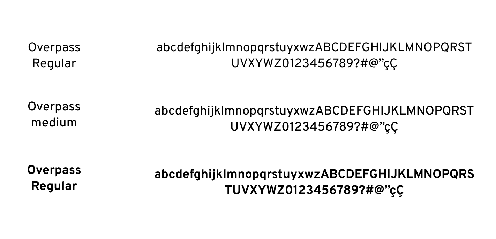
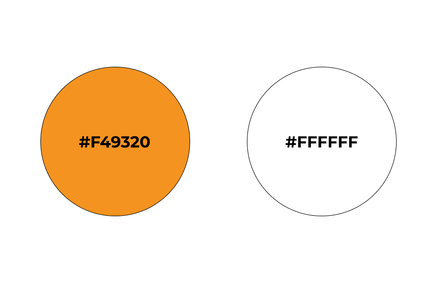
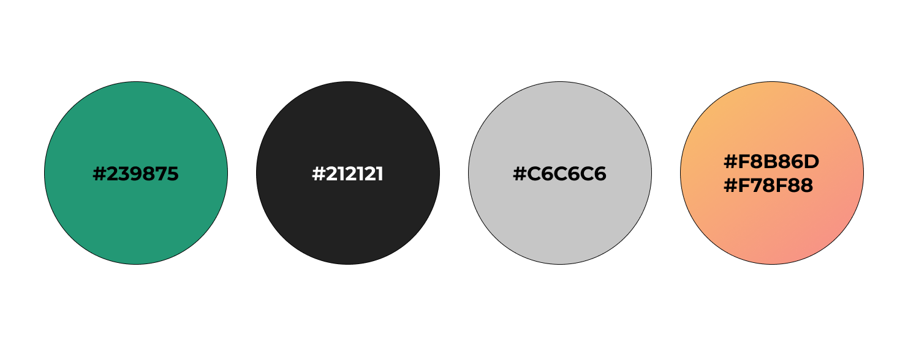

# Guia de estilo

## 1. Introdução

O guia de estilo é um conjunto de diretrizes que estabelece padrões e regras para a escrita e apresentação de design para um produto.
Tem como principal objetivo ajudar a manter a consistência na comunicação visual do projeto, aumentando a sua legibilidade, reconhecimento e memorização pelo público-alvo.

## 2. Logo

### 2.1 Logo padrão

### 2.2 Logo versão negativo

### 2.3 Logo simplificada

|                            Padrão                            |                               Negativo                                |
| :----------------------------------------------------------: | :-------------------------------------------------------------------: |
|  |  |

## 3. Estrutura dos templates

### 3.1 Tipografia

A principal família tipográfica definida para o projeto é a Overpass e suas variações de estilo.

### 3.2 Cores

#### Primárias

#### Secundárias

### 3.3 Ícones

Os icones utilizados na aplicação são obtidos a partir da biblioteca [material-icons](https://mui.com/pt/material-ui/material-icons/)

## 4. Referências

> [1] Style Guide. Disponivel em: https://aelaschool.com/designvisual/style-guide-como-desenvolver-o-guia-de-estilo-da-sua-interface/

> [2] Material UI. Disponível em: https://mui.com/pt/material-ui

## 5. Histórico da versão

| **Data**   | **Descrição**                       | **Autor(es)**         |
| ---------- | ----------------------------------- | --------------------- |
| 01/05/2023 | Criação do documento guia de estilo | Lucas Gabriel Bezerra |
| 15/05/2023 | Revisão do documento | João Pedro |
