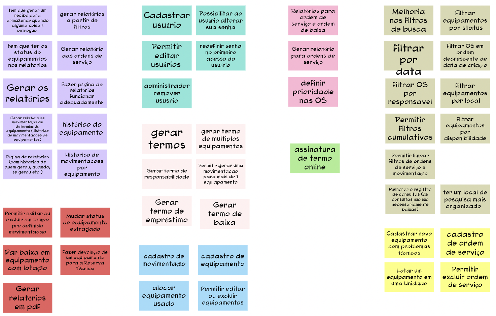

# Brainstorm de Funcionalidades

## 1. Definição

Durante a etapa de "Brainstorm de Funcionalidades" no Lean Inception, a equipe se reúne para estimular a criatividade e gerar uma variedade de ideias e sugestões de funcionalidades para o produto ou projeto em desenvolvimento. O objetivo é explorar diferentes possibilidades que atendam às necessidades dos usuários e ajudem a alcançar os objetivos estabelecidos previamente.

## 2. Resultado

## 3. Referências

> [1] EQUIPE ALECTRION 2022-2. Brainstorm. Disponível em: https://fga-eps-mds.github.io/2022-2-Alectrion-DOC/#/./Leaninception/brainstorm

## 4. Histórico de versão

|**Data**|**Descrição**|**Autor(es)**|
|--------|-------------|--------------|
|25/05/2023| Criação do Documento | João Pedro |

