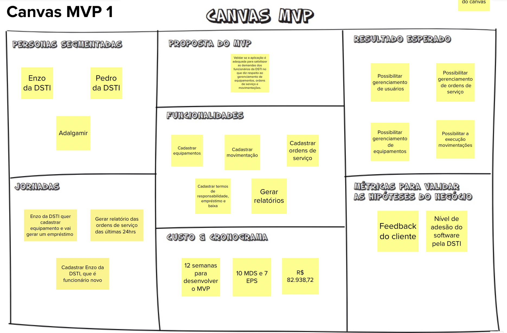
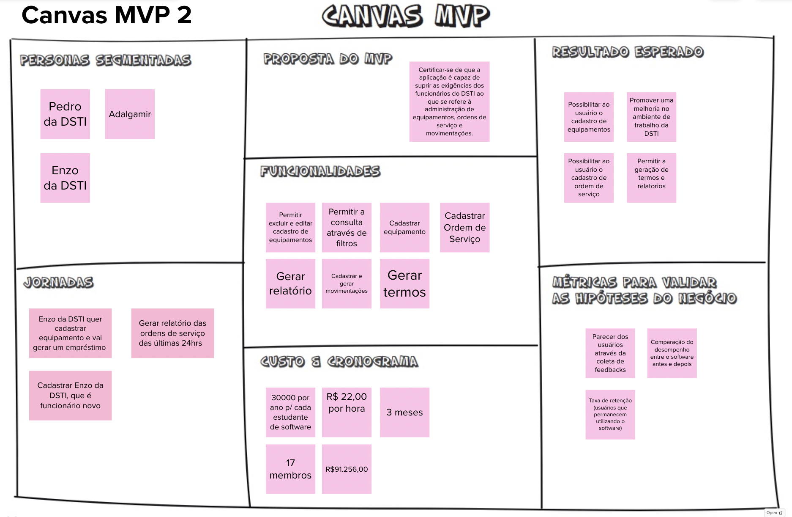

# Canvas MVP

## 1. Definição

Durante a etapa "Canvas MVP" no Lean Inception, a equipe elabora um MVP Canvas, que é um Modelo de Negócio Mínimo Viável. Essa ferramenta visual auxilia na definição e comunicação dos principais elementos do modelo de negócio relacionados ao produto ou projeto em desenvolvimento. O MVP Canvas permite que a equipe tenha uma visão clara e compartilhada dos aspectos fundamentais do modelo de negócio subjacente ao produto, facilitando a compreensão e a definição de estratégias para o sucesso do projeto.

## 2. Resultados

## 3. Referências

> [1] EQUIPE ALECTRION 2022-2. Canvas MVP. Disponível em: https://fga-eps-mds.github.io/2022-2-Alectrion-DOC/#/./Leaninception/mvp

## 4. Histórico de versão

|**Data**|**Descrição**|**Autor(es)**|
|--------|-------------|--------------|
|25/05/2023| Criação do Documento | João Pedro |

