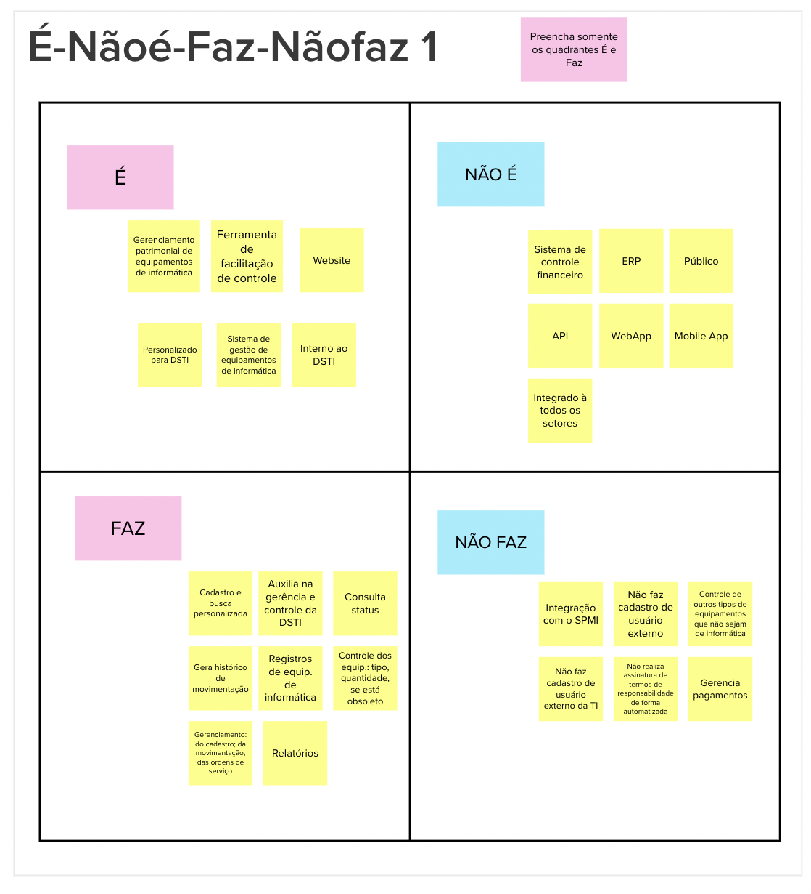

# É, Não é, Faz, Não faz

## 1. Definição

Durante a etapa do "é, não é, faz, não faz" no Lean Inception, a equipe colabora para estabelecer de forma precisa os limites do escopo do produto ou projeto. Nesse estágio, são identificados de maneira clara o que o produto ou projeto é, o que não é, o que faz e o que não faz. Essa abordagem é essencial para estabelecer critérios definidos e evitar ambiguidades na definição do escopo.

## 2. Resultado

## 3. Referências

> [1] EQUIPE ALECTRION 2022-2. É, Não é, Faz, Não faz. Disponível em: https://fga-eps-mds.github.io/2022-2-Alectrion-DOC/#/./Leaninception/e-naoe-faz-naofaz

## 4. Histórico de versão

|**Data**|**Descrição**|**Autor(es)**|
|--------|-------------|--------------|
|25/05/2023| Criação do Documento | João Pedro |
|25/05/2023| Revisão do Documento | Dafne |
| 26/05/2023 | Revisão do documento | Lucas Lima |

