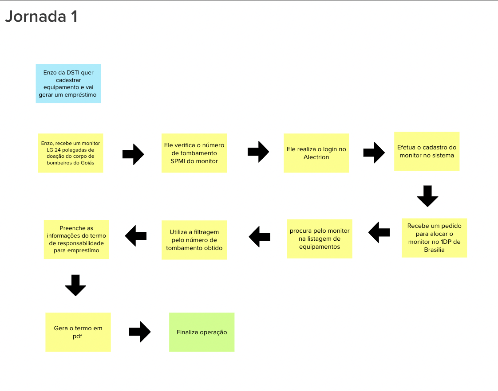
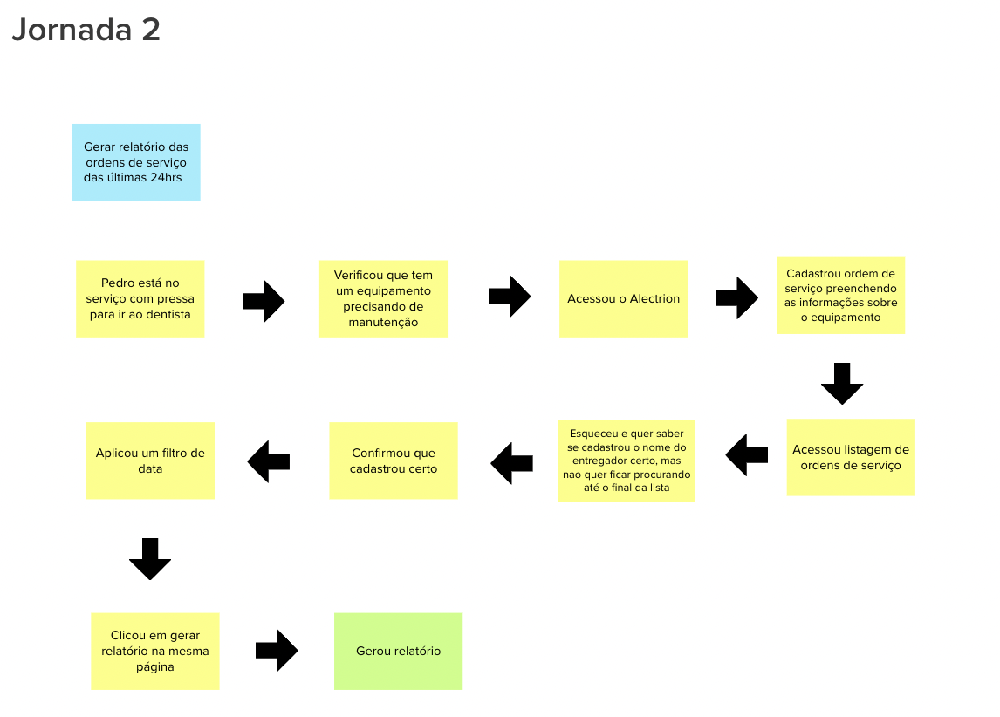
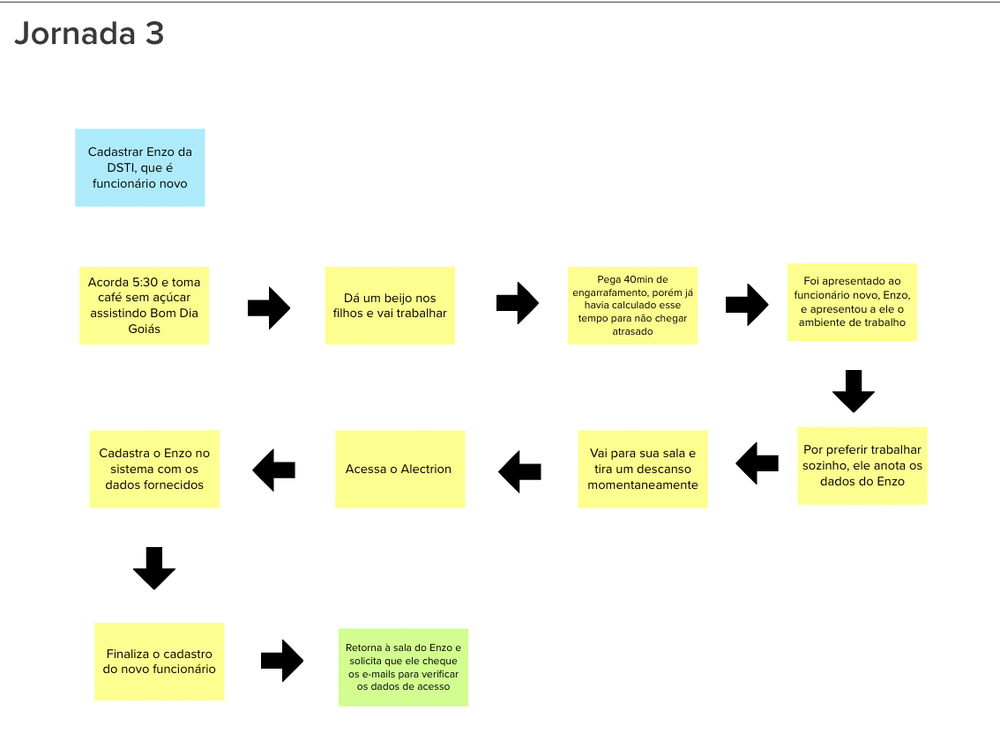

# Jornadas de Usuário

## 1. Definição

As jornadas do usuário durante o Lean Inception são uma estratégia empregada para compreender e mapear a experiência do usuário ao utilizar um produto ou serviço. Elas são representações visuais ou narrativas que ilustram as etapas e sentimentos envolvidos na execução de uma determinada tarefa pelo usuário, desde o início até a conclusão.

## 2. Resultado

## 3. Referências

> [1] EQUIPE ALECTRION 2022-2. Jornadas de usuário. Disponível em: https://fga-eps-mds.github.io/2022-2-Alectrion-DOC/#/./Leaninception/jornadas

## 4. Histórico de versão

|**Data**|**Descrição**|**Autor(es)**|
|--------|-------------|--------------|
|25/05/2023| Criação do Documento | João Pedro |
|25/05/2023| Revisão do Documento | Dafne |
| 26/05/2023 | Revisão do documento | Lucas Lima |

