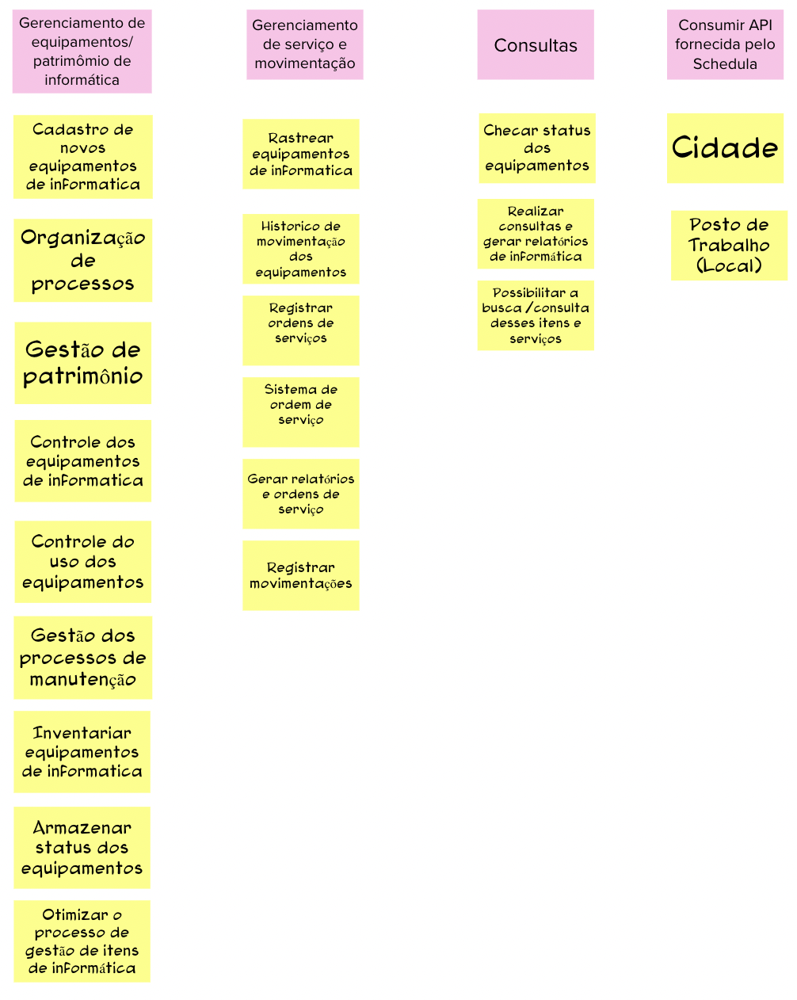

# Objetivos do Produto

## 1. Definição

Durante a etapa de "Objetivos do Produto" no Lean Inception, a equipe se concentra em definir os objetivos estratégicos que o produto ou projeto pretende alcançar. Nessa fase, ocorre uma colaboração entre os membros da equipe para identificar e estabelecer metas específicas que orientarão o desenvolvimento do produto.

## 2. Resultado

## 3. Referências

> [1] EQUIPE ALECTRION 2022-2. Objetivos. Disponível em: https://fga-eps-mds.github.io/2022-2-Alectrion-DOC/#/./Leaninception/objetivos

## 4. Histórico de versão

|**Data**|**Descrição**|**Autor(es)**|
|--------|-------------|--------------|
|25/05/2023| Criação do Documento | João Pedro |
|25/05/2023| Revisão do Documento | Dafne |

