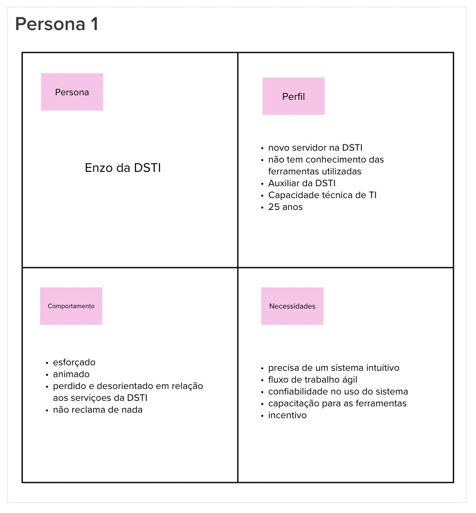
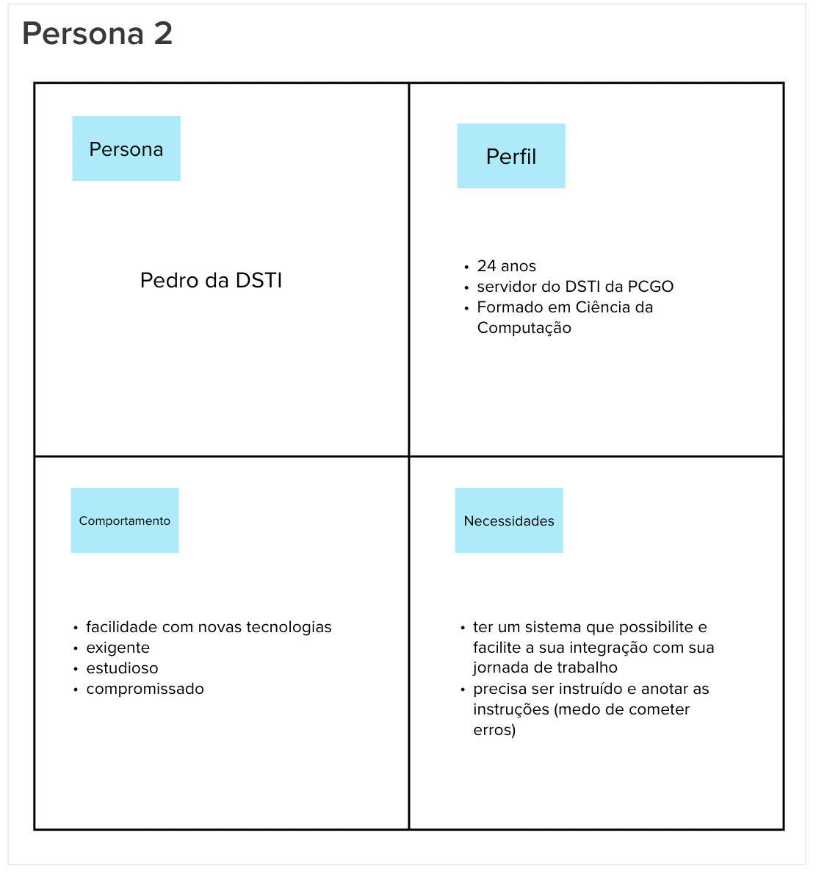
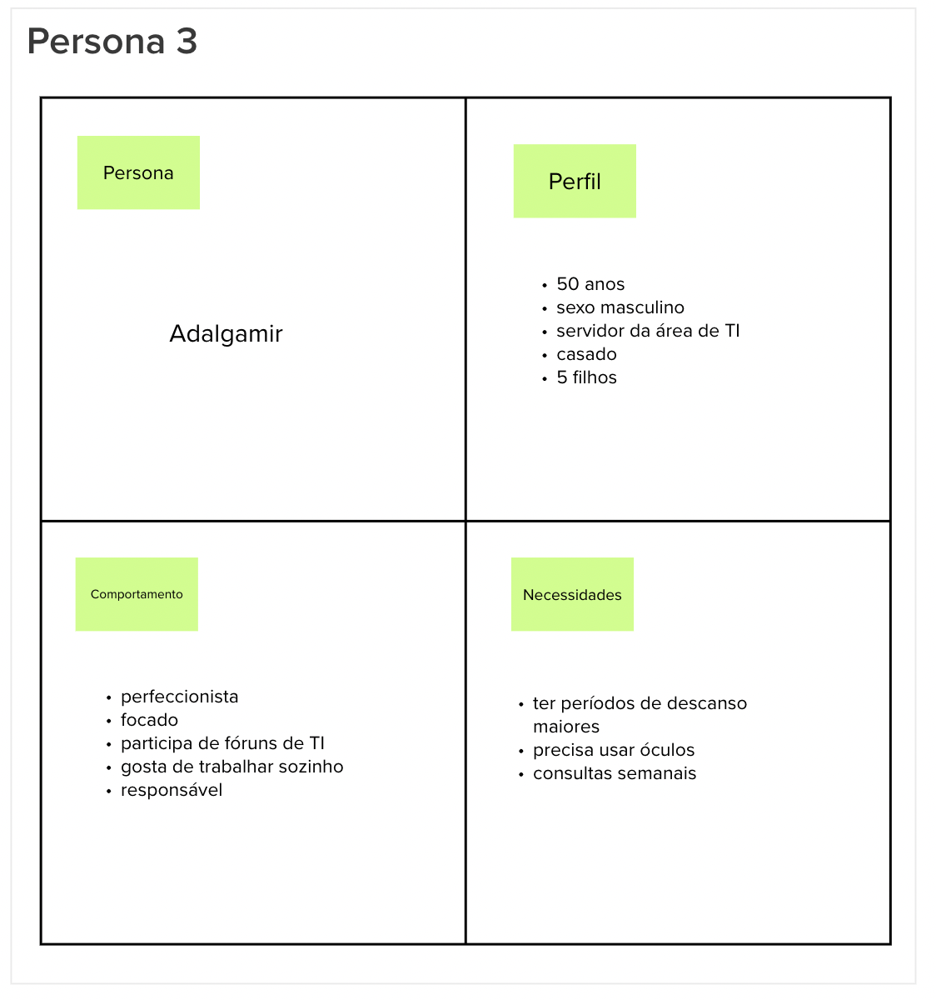

# Personas

## 1. Definição

Durante a etapa de "Personas" no Lean Inception, a equipe desenvolve personas fictícias que representam usuários típicos, com o objetivo de aprofundar a compreensão de suas necessidades, desejos e comportamentos. Essas personas são perfis fictícios que proporcionam uma visão mais clara e abrangente dos usuários-alvo do produto ou projeto, facilitando a compreensão das suas características.

## 2. Resultado

## 3. Referências

> [1] EQUIPE ALECTRION 2022-2. Personas. Disponível em: https://fga-eps-mds.github.io/2022-2-Alectrion-DOC/#/./Leaninception/personas

## 4. Histórico de versão

|**Data**|**Descrição**|**Autor(es)**|
|--------|-------------|--------------|
|25/05/2023| Criação do Documento | João Pedro |

