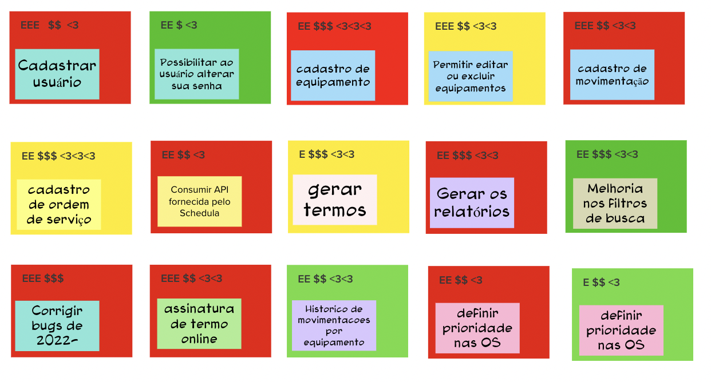

# Revisão técnica, de negócio e de UX

## 1. Definição

Durante a etapa de "Revisão técnica, de negócio e de UX" no Lean Inception, a equipe realiza uma análise minuciosa das ideias de funcionalidades geradas durante o brainstorm, considerando aspectos técnicos, de negócio e de experiência do usuário (UX). O objetivo principal é avaliar a viabilidade e o impacto de cada funcionalidade proposta, garantindo que estejam alinhadas aos objetivos do produto e às necessidades dos usuários.

## 2. Resultado

## 3. Referências

> [1] EQUIPE ALECTRION 2022-2. Revisão técnica, de negócio e de UX. Disponível em: https://fga-eps-mds.github.io/2022-2-Alectrion-DOC/#/./Leaninception/revisao-tecnica

## 4. Histórico de versão

|**Data**|**Descrição**|**Autor(es)**|
|--------|-------------|--------------|
|25/05/2023| Criação do Documento | João Pedro |
|25/05/2023| Revisão do Documento | Dafne |
| 26/05/2023 | Revisão do documento | Lucas Lima |

