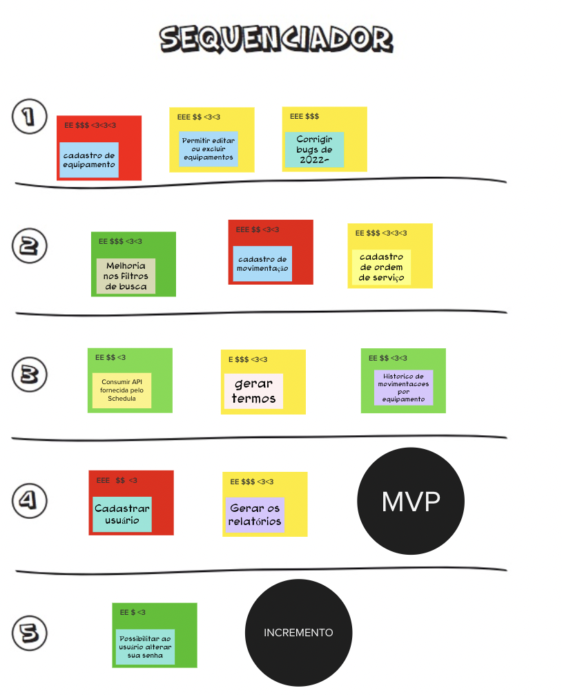

# Sequenciador

## 1. Definição

O "Sequenciador" é uma atividade que tem como objetivo estabelecer a sequência de prioridade das funcionalidades ou histórias de usuário a serem implementadas ao longo do desenvolvimento do produto.

## 2. Resultado

## 3. Referências

> [1] EQUIPE ALECTRION 2022-2. Sequenciador. Disponível em: https://fga-eps-mds.github.io/2022-2-Alectrion-DOC/#/./Leaninception/sequenciador

## 4. Histórico de versão

|**Data**|**Descrição**|**Autor(es)**|
|--------|-------------|--------------|
|25/05/2023| Criação do Documento | João Pedro |

