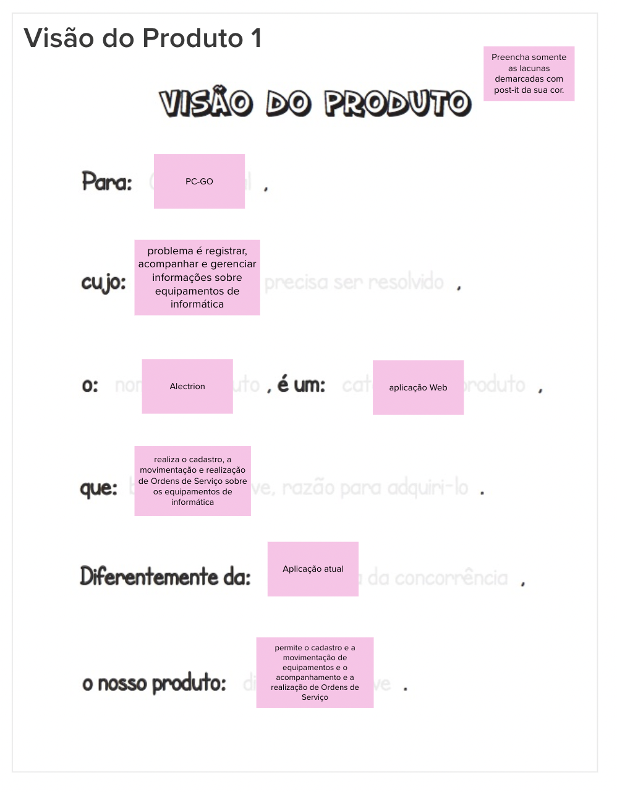
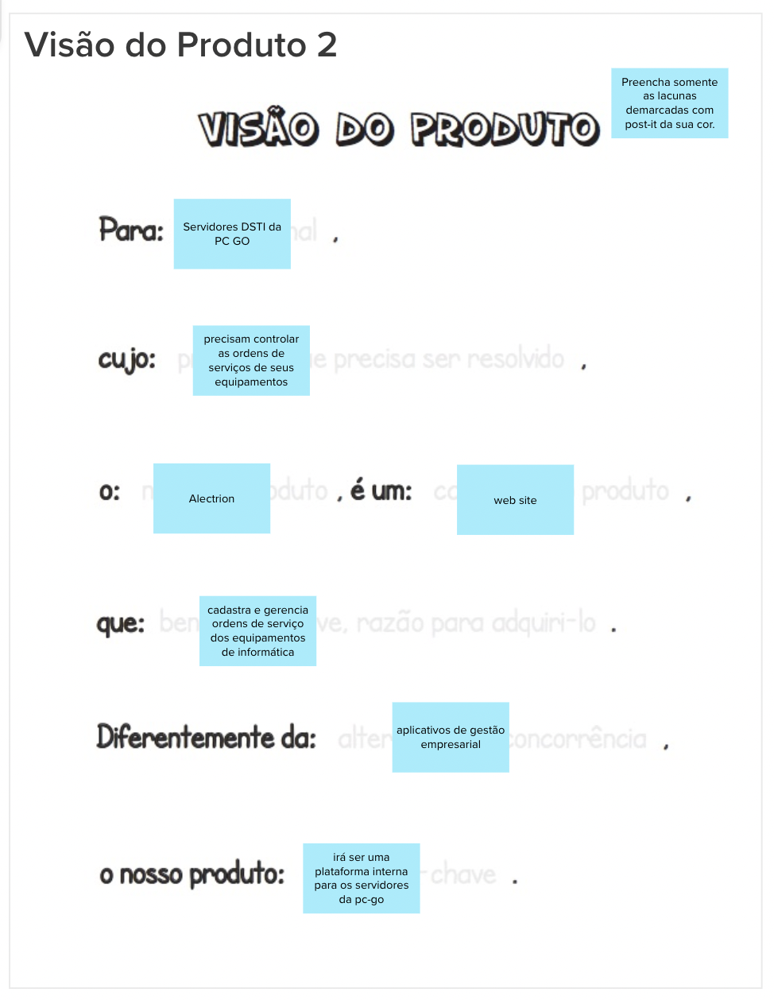
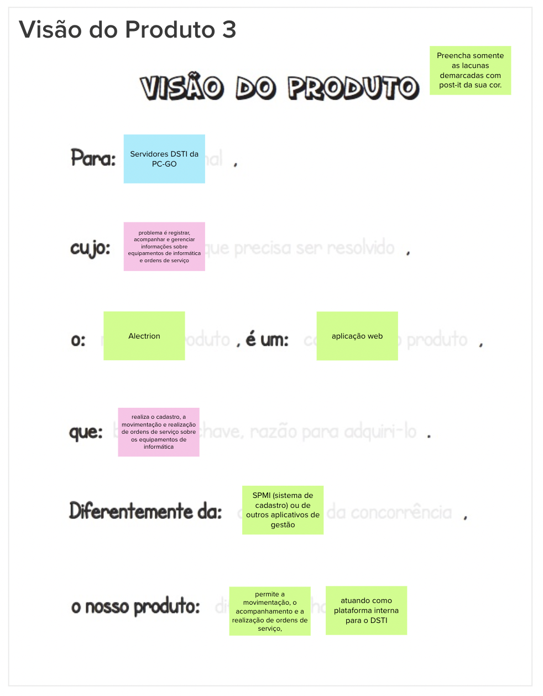

# Visão do Produto

## 1. Definição

Durante a etapa de visão do produto no Lean Inception, é essencial para a equipe criar uma visão abrangente e consensual do produto ou projeto em desenvolvimento. Nesse estágio, é importante compreender e estabelecer os objetivos estratégicos, metas e propósito do produto, além de sua proposta de valor.

## 2. Resultado

## 3. Referências

> [1] EQUIPE ALECTRION 2022-2. Visão do produto. Disponível em: https://fga-eps-mds.github.io/2022-2-Alectrion-DOC/#/./Leaninception/visao-do-produto

## 4. Histórico de versão

|**Data**|**Descrição**|**Autor(es)**|
|--------|-------------|--------------|
|25/05/2023| Criação do Documento | João Pedro |
|25/05/2023| Revisão do Documento | Dafne |
| 26/05/2023 | Revisão do documento | Lucas Lima |

