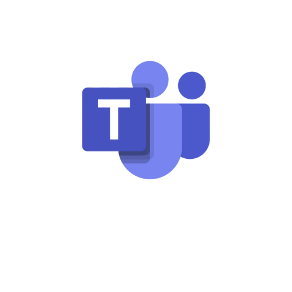

# Planejamento da comunicação externa e interna

## 1. Introdução
Este documento possui a finalidade de elucidar como foi organizada e estruturada a comunicação entre as equipes de EPS e MDS, os *product owners* da DSTI, e o professor Hilmer, responsável pelo projeto.

## 2. Ferramentas para comunicação

Utilizaremos as seguintes ferramentas conforme a finalidade de cada uma:

|**Logo**|**Nome**|**Finalidade**|
|--------|-------------|---------|
||Discord|Comunicação rápida entre a equipe e *product owner*, além da comunicação e organização interna da equipe|
||Microsoft Teams|Reuniões internas da equipe que necessitem de gravação e reuniões com o *product owner*|
||Telegram|Comunicação rápida e de acesso fácil entre os integrantes da equipe de EPS|
||Whatsapp|Comunicação rápida e de acesso fácil entre os integrantes da equipe de EPS e MDS|
||Google Drive|Gerenciamento de arquivos, como planilhas, atas e outros documentos|
||Github|Repositório com os documentos, arquivos, códigos, dentre outros recursos relacionados ao projeto|
||ZenHub| Acompanhamento e gerenciamento do projeto|

## 3. Reuniões

Considerando que as _sprints_ serão de 1 semana, teremos reuniões internas e externas conforme explicado nas seções a seguir.

### 3.1 Reuniões Internas

Se referem à equipe de EPS e MDS envolvidos diretamente com o projeto.

|**Objetivo**|**Envolvidos**|**Frequência**|**Dia e Horário**|**Meio**|**Ferramenta**(ou local)|
|------------|--------------|--------------|-----------|--------|--------|
|Planejamento de *sprint*| EPS e MDS| Semanal | Quarta-feira, das 21h00 às 22h00|Remoto|Discord|

**OBS**: Reuniões com o *product owner* e acompanhamentos podem ser realizados sob demanda.

(1) Essa atividade terá como pauta os seguintes pontos: i) O que estou fazendo hoje?; ii) O que pretendo fazer amanhã?; iii) Estou tendo dificuldades? Se sim, quais?.

### 3.2 Reuniões Externas

Se referem tanto à equipe (EPS e MDS) quanto aos demais interessados.

|**Objetivo**|**Envolvidos**|**Frequência**|**Dia e Horário**|**Meio**|**Ferramenta**(ou local)|
|------------|--------------|--------------|-----------|--------|--------|
|Reunião de revisão e acompanhamento com o *product owner*| EPS, MDS, DSTI, prof. Hilmer| Semanal| Quarta-feira, de 20h00 às 21h00| Remoto|Teams|

**OBS**: Outras reuniões podem ser realizadas sob demanda.

## 4. Referências

<!-- Referências enumeradas-->

> [1] EQUIPE ALECTRION 2022-2. Plano de Comunicação. Disponível em: https://fga-eps-mds.github.io/2022-2-Alectrion-DOC/#/./Planejamento/comunicacao

## 5. Histórico de versão

|**Data**|**Descrição**|**Autor(es)**|
|--------|-------------|--------------|
|24/04/2023| Criação do plano de comunicação | Aline Lermen |

