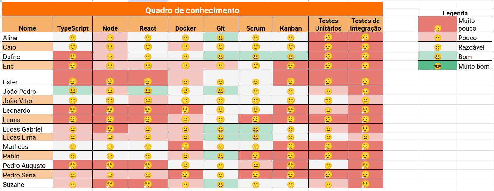
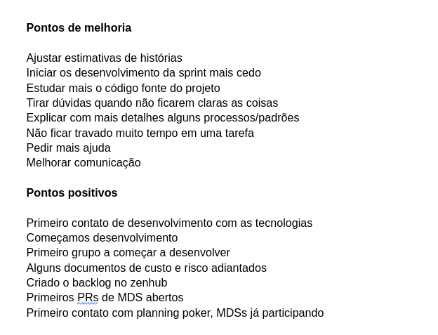

# Sprint 1

- Data de início: 26/04/2023
- Data de término: 03/05/2023

## Objetivos da sprint
* Início do desenvolvimento das funcionalidades
    * épico de Equipamentos
* Adicionar o backlog no Zenhub

## Backlog da Sprint
|**US**|**Responsáveis**|**EPS responsável**|
|--------|-------------|-------------|
| [US 01: Cadastrar equipamento](https://github.com/fga-eps-mds/2023-1-Alectrion-DOC/issues/31) |Suzane, Felipe| Lucas Gabriel|
| [US 02: Editar equipamento](https://github.com/fga-eps-mds/2023-1-Alectrion-DOC/issues/36)    |Ester, Matheus| Caio|
| [US 03: Excluir equipamento](https://github.com/fga-eps-mds/2023-1-Alectrion-DOC/issues/37)   |Pedro Izarias, Pedro Sena| Lucas Lima|
| [US 04: Listar equipamentos](https://github.com/fga-eps-mds/2023-1-Alectrion-DOC/issues/64)   |Luana, Eric| Aline|

## Outras atividades
|**Atividade**|**Responsáveis**|
|--------|-------------|
Aumentar cobertura de testes do EquipmentAPI | João e Dafne
Deploy da documentação | Lucas e Caio
Adição de template de PR e labels no repositório | João
Adição do backlog no zenhub | Aline

## *Squads*
|**Squad 1**|**Squad 2**     |**Squad 3**|
|-----------|----------------|-----------|
| João Pedro| Lucas Gabriel  | João Vitor
| Dafne     | Lucas Lima     | Aline
| Caio      | Suzane         | Pablo
| Ester     | Felipe         | Leonardo
| Matheus   | Pedro          | Eric
|    -      | Pedro          | Luana

## Quadro de conhecimento

## Retrospectiva da sprint 1

## Histórico de versão

|**Data**|**Descrição**|**Autor(es)**|
|--------|-------------|--------------|
| 25/04/2023 | Criação da estrutura do documento | Aline Lermen |
| 11/05/2023 | Adição das informações no documento | Aline Lermen |
| 23/05/2023 | Revisão do documento | Dafne Moretti |