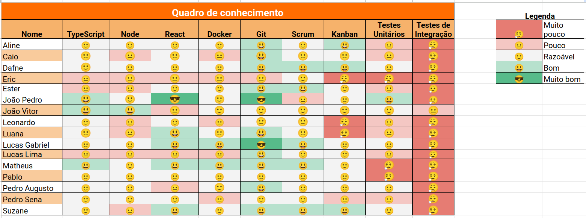
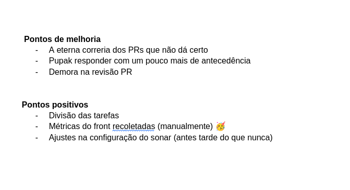

# Sprint 10

- Data de início: 28/06/2023
- Data de término: 05/07/2023

## Objetivos da sprint
* Finalizar o trabalho não concluído da sprint anterior
    - US 16, US 17, US 18
* US 22, US 23, US 24
* Refatoração do frontend
* Melhorias na parte de usuários do sistema
* Coleta retroativa de métricas para o Analytics

## Backlog da Sprint
|**US**|**Responsáveis**|**EPS responsável**|
|--------|-------------|-------------|
| [US 16: Gerar relatórios de ordem de serviço](https://github.com/fga-eps-mds/2023-1-alectrion-doc/issues/61)   | Matheus, Pedro Izarias | - |
| [US 17: Gerar relatórios de equipamentos](https://github.com/fga-eps-mds/2023-1-Alectrion-DOC/issues/62)       | Leonardo, Pedro Sena  | - |
| [US 18: Gerar relatórios de movimentações](https://github.com/fga-eps-mds/2023-1-Alectrion-DOC/issues/63)      | Ester, Eric  | - |
| [US 22: Cadastro de marca de equipamento](https://github.com/fga-eps-mds/2023-1-alectrion-doc/issues/138)      | João Vitor, Lucas Lima, Caio | - |
| [US 23: Cadastro de tipo de equipamento](https://github.com/fga-eps-mds/2023-1-alectrion-doc/issues/139)       | João Vitor, Lucas Lima, Caio | - |
| [US 24:  Criar vários equipamentos com as mesmas especificacoes](https://github.com/fga-eps-mds/2023-1-alectrion-doc/issues/150)       | Dafne, Lucas Gabriel, Suzane, Pablo | - |

## Outras atividades
|**Atividades**|**Responsáveis**|
|--------|-------------|
Refatoração do frontend | EPS
Melhorias em usuários do sistema | EPS e MDS
Coleta retroativa de métricas | EPS

## *Squads*
|**Squad 1**    |**Squad 2**     |**Squad 3**|
|---------------|----------------|--------------|
| Aline         | Dafne          | Lucas Lima
| Lucas Gabriel | João Vitor     | Caio
| Matheus       | Leonardo       | João Pedro
| Pedro Izarias | Pedro Sena     | Ester
|      -        | Pablo          | Eric
|      -        | Luana          | Suzane

## Quadro de conhecimento

## Retrospectiva da sprint 10

## Histórico de versão

|**Data**|**Descrição**|**Autor(es)**|
|--------|-------------|--------------|
| 29/06/2023 | Criação do documento | Aline Lermen |
| 06/07/2023 | Adição da retrospectiva e quadro | Aline Lermen |
| 09/07/2023 | Revisão do documento | Dafne Moretti |
