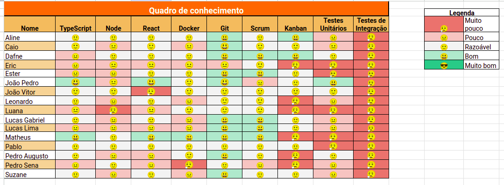
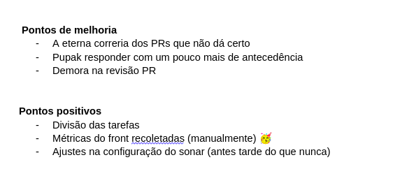

# Sprint 11

- Data de início: 05/07/2023
- Data de término: 10/07/2023

## Objetivos da sprint
* Finalizar o trabalho não concluído da sprint anterior
    - US 16, US 17, US 18, US 22, US 23
* Correção de bugs
* Aumento de cobertura de testes
* Responder as questões referentes à qualidade
* Revisão do EVM Agile

## Backlog da Sprint
|**US**|**Responsáveis**|**EPS responsável**|
|--------|-------------|-------------|
| [US 16: Gerar relatórios de ordem de serviço](https://github.com/fga-eps-mds/2023-1-alectrion-doc/issues/61)   | Matheus, Pedro Izarias | - |
| [US 17: Gerar relatórios de equipamentos](https://github.com/fga-eps-mds/2023-1-Alectrion-DOC/issues/62)       | Leonardo, Pedro Sena  | - |
| [US 18: Gerar relatórios de movimentações](https://github.com/fga-eps-mds/2023-1-Alectrion-DOC/issues/63)      | Ester, Eric  | - |
| [US 22: Cadastro de marca de equipamento](https://github.com/fga-eps-mds/2023-1-alectrion-doc/issues/138)      | João Vitor, Lucas Lima, Caio | - |
| [US 23: Cadastro de tipo de equipamento](https://github.com/fga-eps-mds/2023-1-alectrion-doc/issues/139)       | João Vitor, Lucas Lima, Caio | - |

## Outras atividades
|**Atividades**|**Responsáveis**|
|--------|-------------|
Correção de bugs | EPS
Aumento de cobertura de testes | EPS
Responder as questões referentes à qualidade | EPS
Revisão do EVM Agile | EPS

## *Squads*
|**Squad 1**    |**Squad 2**     |**Squad 3**|
|---------------|----------------|--------------|
| Aline         | Dafne          | Lucas Lima
| Lucas Gabriel | João Vitor     | Caio
| Matheus       | Leonardo       | João Pedro
| Pedro Izarias | Pedro Sena     | Ester
|      -        | Pablo          | Eric
|      -        | Luana          | Suzane

## Quadro de conhecimento

## Retrospectiva da sprint 11

## Histórico de versão

|**Data**|**Descrição**|**Autor(es)**|
|--------|-------------|--------------|
| 09/07/2023 | Criação do documento | Dafne Moretti |
| 09/07/2023 | Adição da retrospectiva e quadro | Dafne Moretti |
