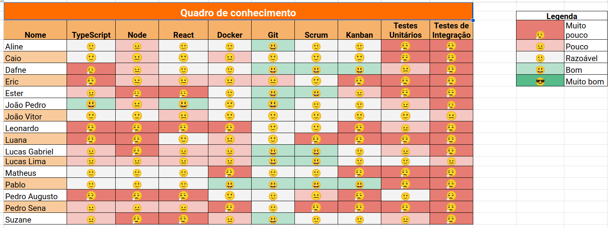
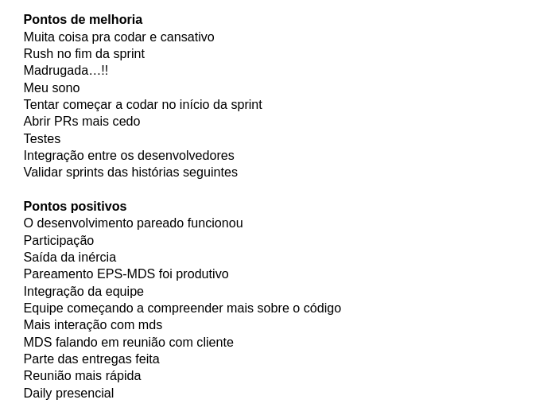

# Sprint 2

- Data de início: 03/05/2023
- Data de término: 10/05/2023

## Objetivos da sprint
* Finalizar os trabalhos não concluídos da sprint anterior
    * US 1, US 2, US 3, US 4
* Iniciar Épico de movimentações
    * US 5

## Backlog da Sprint
|**US**|**Responsáveis**|
|--------|-------------|
| [US 01: Cadastrar equipamento](https://github.com/fga-eps-mds/2023-1-Alectrion-DOC/issues/31)    |Suzane, Lucas Gabriel|
| [US 02: Editar equipamento](https://github.com/fga-eps-mds/2023-1-Alectrion-DOC/issues/36)       |Ester, Matheus|
| [US 03: Excluir equipamento](https://github.com/fga-eps-mds/2023-1-Alectrion-DOC/issues/37)      |Pedro Izarias, Pedro Sena|
| [US 04: Listar equipamentos](https://github.com/fga-eps-mds/2023-1-Alectrion-DOC/issues/64)      |Luana, Eric|
| [US 05: Registrar movimentações](https://github.com/fga-eps-mds/2023-1-alectrion-doc/issues/50)  |Pablo, Leonardo|

## Outras atividades
|**Atividades**|**Responsáveis**|
|--------|-------------|
Continuar com a elaboração de documentação | EPS

## *Squads*
|**Squad 1**|**Squad 2**     |**Squad 3**|
|-----------|----------------|-----------|
| Dafne     |  João Pedro    | João Vitor
| Caio      | Lucas Gabriel  | Aline
| Ester     | Lucas Lima     | Pablo
| Matheus   | Suzane         | Leonardo
|    -      | Pedro          | Eric
|    -      | Pedro          | Luana

## Quadro de conhecimento

## Retrospectiva da sprint 2

## Histórico de versão

|**Data**|**Descrição**|**Autor(es)**|
|--------|-------------|--------------|
| 14/05/2023 | Criação do documento | Aline Lermen |
| 23/05/2023 | Revisão do documento | Dafne Moretti |