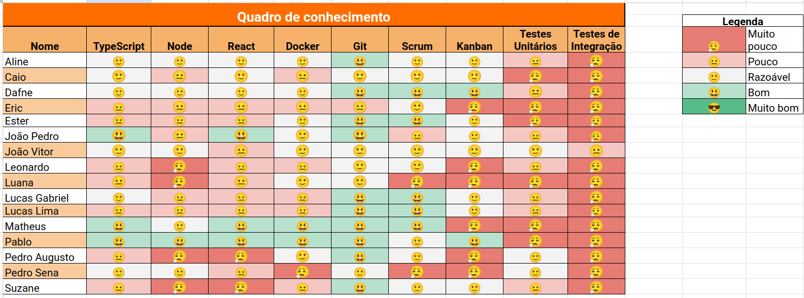
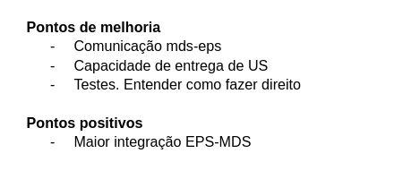

# Sprint 3

- Data de início: 10/05/2023
- Data de término: 17/05/2023

## Objetivos da sprint
* Finalizar os trabalhos não concluídos da sprint anterior
    * US 2, US 5

## Backlog da Sprint
|**US**|**Responsáveis**|**EPS responsável**|
|--------|-------------|-------------|
| [US 02: Editar equipamento](https://github.com/fga-eps-mds/2023-1-Alectrion-DOC/issues/36)       |Dafne (EPS), Caio (EPS) | - |
| [US 05: Registrar movimentações](https://github.com/fga-eps-mds/2023-1-alectrion-doc/issues/50)  |Pablo, Leonardo| João Vitor |
| [US 05: Registrar movimentações](https://github.com/fga-eps-mds/2023-1-alectrion-doc/issues/50)  |Eric, Suzane| Aline |
| [Filtros de movimentações](https://github.com/fga-eps-mds/2023-1-Alectrion-DOC/issues/81)        |Lucas Gabriel (EPS), Pedro Izarias| João Pedro |
| [Filtros de equipamentos](https://github.com/fga-eps-mds/2023-1-alectrion-doc/issues/84)         |Luana, Matheus| Lucas Lima |

## Outras atividades
|**Atividades**|**Responsáveis**|
|--------|-------------|
Continuar com a elaboração de documentação | EPS

## *Squads*
|**Squad 1** |**Squad 2**     |**Squad 3**|
|------------|----------------|-----------|
| Dafne      | João Pedro     | João Vitor
| Caio       | Lucas Gabriel  | Aline
| Ester      | Lucas Lima     | Pablo
| Pedro Sena | Luana          | Leonardo
|     -      | Pedro Izarias  | Eric
|     -      | Matheus        | Suzane

## Quadro de conhecimento

## Retrospectiva da sprint 3

## Histórico de versão

|**Data**|**Descrição**|**Autor(es)**|
|--------|-------------|--------------|
| 15/05/2023 | Criação do documento | Aline Lermen |
| 18/05/2023 | Adição da retrospectiva e quadro de conhecimento | Aline Lermen |
| 23/05/2023 | Revisão do documento | Dafne Moretti |