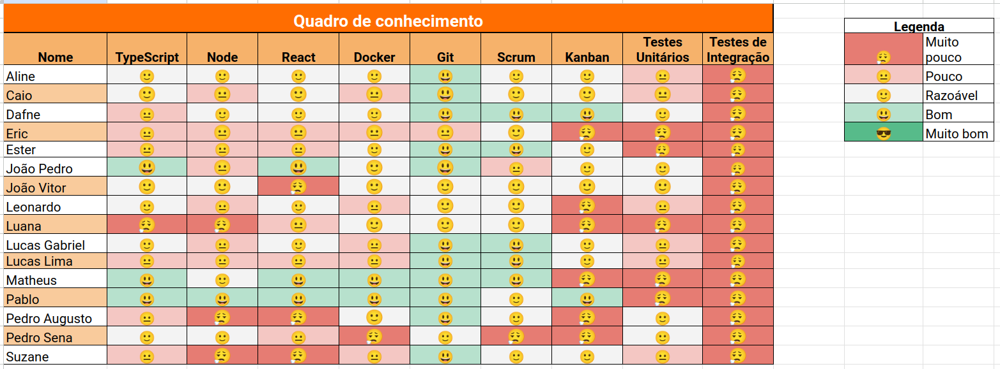
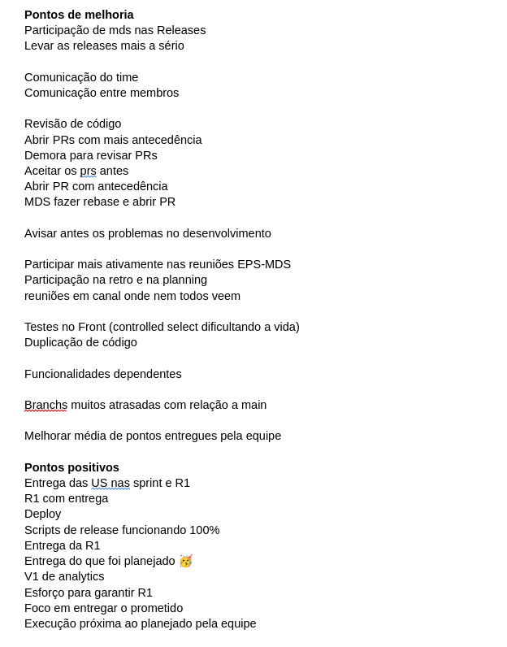

# Sprint 4

- Data de início: 17/05/2023
- Data de término: 24/05/2023

## Objetivos da sprint
* Finalizar os trabalhos não concluídos da sprint anterior
	- algumas tarefas da US 5, de registro de movimentação
	- US 3, de exclusão de equipamento
	- tarefas de filtros de equipamento e movimentação
- Resolução de bugs

## Backlog da Sprint
|**US**|**Responsáveis**|**EPS responsável**|
|--------|-------------|-------------|
| [US 03: Excluir equipamento](https://github.com/fga-eps-mds/2023-1-Alectrion-DOC/issues/37)       |Ester, Pedro Sena | Dafne e Caio |
| [US 05: Registrar movimentações](https://github.com/fga-eps-mds/2023-1-alectrion-doc/issues/50)   |Pablo, Leonardo| João Vitor |
| US 5 ([Filtros de movimentações](https://github.com/fga-eps-mds/2023-1-Alectrion-DOC/issues/81))  |Eric, Pedro Izarias| João Pedro |
| US 4 ([Filtros de equipamentos](https://github.com/fga-eps-mds/2023-1-alectrion-doc/issues/84))   |Luana, Matheus| Lucas Lima, Lucas Gabriel |

## Outras atividades
|**Atividades**|**Responsáveis**|
|--------|-------------|
Continuar com a elaboração de documentação | EPS
Criação roteiro de testes | EPS
Testes | Suzane e Aline

## *Squads*
|**Squad 1** |**Squad 2**     |**Squad 3**|
|------------|----------------|-----------|
| Dafne      | João Pedro     | João Vitor
| Caio       | Lucas Gabriel  | Aline
| Ester      | Lucas Lima     | Pablo
| Pedro Sena | Luana          | Leonardo
|     -      | Pedro Izarias  | Eric
|     -      | Matheus        | Suzane

## Quadro de conhecimento

## Retrospectiva da sprint 4

## Histórico de versão

|**Data**|**Descrição**|**Autor(es)**|
|--------|-------------|--------------|
| 26/05/2023 | Criação do documento | Aline Lermen |
| 05/06/2023 | Adição da retrospectiva | Aline Lermen |
| 09/07/2023 | Revisão do documento | Dafne Moretti |