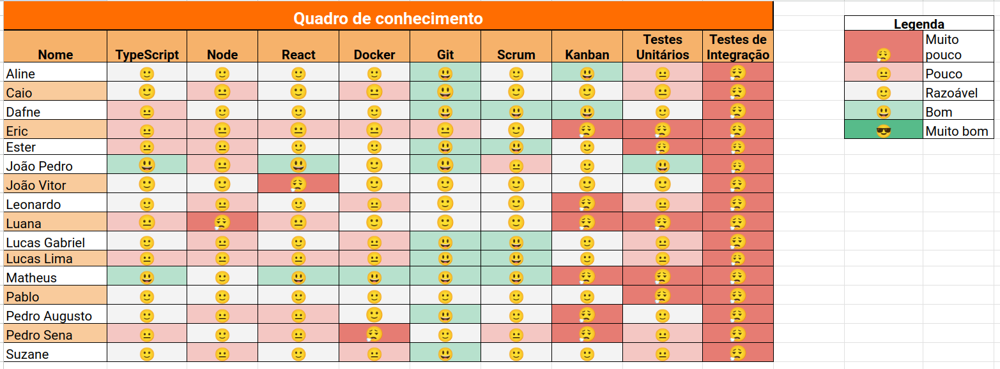
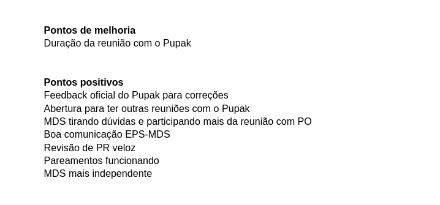

# Sprint 5

- Data de início: 24/05/2023
- Data de término: 31/05/2023

## Objetivos da sprint
* Geração de termos de movimentação
    - US 10: Gerar termo de baixa
    - US 19: Gerar termo de responsabilidade
    - US 20: Gerar termo de empréstimo
* US 8: Cadastrar ordem de serviço
* US 9: Listar ordens de serviço
- Resolução de bugs

## Backlog da Sprint
|**US**|**Responsáveis**|**EPS responsável**|
|--------|-------------|-------------|
| [US 10: Gerar termo de baixa](https://github.com/fga-eps-mds/2023-1-Alectrion-DOC/issues/37)               | Leonardo, Dafne          | - |
| [US 19: Gerar termo de responsabilidade](https://github.com/fga-eps-mds/2023-1-Alectrion-DOC/issues/37)    | Suzane, Pablo            | - |
| [US 20: Gerar termo de empréstimo](https://github.com/fga-eps-mds/2023-1-Alectrion-DOC/issues/37)          | Suzane, Pablo            | - |
| [US 08: Cadastrar ordem de serviço](https://github.com/fga-eps-mds/2023-1-alectrion-doc/issues/50)         | Pedro Sena, Lucas Gabriel| - |
| [US 08: Cadastrar ordem de serviço](https://github.com/fga-eps-mds/2023-1-alectrion-doc/issues/50)         | Eric, Matheus            | - |
| [US 09: Listar ordens de serviço](https://github.com/fga-eps-mds/2023-1-Alectrion-DOC/issues/81)           | Ester, Luana             | - |
| [US 09: Listar ordens de serviço](https://github.com/fga-eps-mds/2023-1-Alectrion-DOC/issues/81) (filtros) | Leonardo, João Vitor     | - |

Obs.: Nessa *sprint* a equipe testou a estratégia de não definir um integrante de EPS de apoio para cada pareamento. O motivo foi para que as dúvidas e pedidos de auxílio dos integrantes de MDS não ficasse bloqueado caso não fosse possível entrar em contato com o "EPS de apoio". Apesar disso, ainda estão alocados nos *squads* tanto integrantes de EPS como de MDS.

## Outras atividades
|**Atividades**|**Responsáveis**|
|--------|-------------|
Resolução de bugs | EPS

## *Squads*
|**Squad 1** |**Squad 2**     |**Squad 3**|
|------------|----------------|-----------|
| Dafne      | Aline          | Lucas Gabriel
| Lucas Lima | João Vitor     | Caio
| Leonardo   | Ester          | Matheus
| Suzane     | Luana          | Leonardo
| Pablo      | Pedro Izarias  | Eric
|     -      |       -        |    -

## Quadro de conhecimento

## Retrospectiva da sprint 5

## Histórico de versão

|**Data**|**Descrição**|**Autor(es)**|
|--------|-------------|--------------|
| 05/06/2023 | Criação do documento | Aline Lermen |
