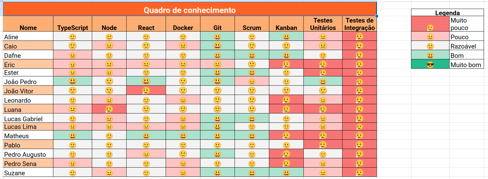
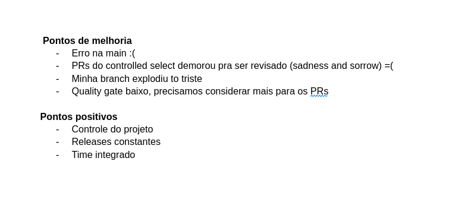

# Sprint 7

- Data de início: 07/06/2023
- Data de término: 14/06/2023

## Objetivos da sprint
* Finalizar os trabalhos não concluídos da sprint anterior
    - US 08, US 10
* US 11, US 13, US 14
* Refatoração de código

## Backlog da Sprint
|**US**|**Responsáveis**|**EPS responsável**|
|--------|-------------|-------------|
| [US 08: Cadastrar ordem de serviço](https://github.com/fga-eps-mds/2023-1-alectrion-doc/issues/50)         | Pedro Sena, Lucas Gabriel| - |
| [US 08: Cadastrar ordem de serviço](https://github.com/fga-eps-mds/2023-1-alectrion-doc/issues/50)         | Eric, Matheus            | - |
| [US 10: Gerar termo de baixa](https://github.com/fga-eps-mds/2023-1-Alectrion-DOC/issues/37)               | Dafne                    | - |
| [US 11: Administrador cadastrar usuários](https://github.com/fga-eps-mds/2023-1-alectrion-doc/issues/55)   | Ester, Pablo             | - |
| [US 13: Realizar login na aplicação](https://github.com/fga-eps-mds/2023-1-Alectrion-DOC/issues/58)        | Suzane, Luana            | - |
| [US 14: Visualizar perfil de usuário](https://github.com/fga-eps-mds/2023-1-Alectrion-DOC/issues/59)       | Pedro Izarias, Leonardo  | - |

## Outras atividades
|**Atividades**|**Responsáveis**|
|--------|-------------|
Refatoração de código | EPS

## *Squads*
|**Squad 1**    |**Squad 2**     |**Squad 3**|
|---------------|----------------|--------------|
| Dafne         | Lucas Lima     | Lucas Gabriel
| Aline         | João Vitor     | Caio
| Leonardo      | João Pedro     | Matheus
| Suzane        | Ester          | Pedro Sena
| Luana         | Pablo          | Eric
| Pedro Izarias |       -        |    -

## Quadro de conhecimento

## Retrospectiva da sprint 7

## Histórico de versão

|**Data**|**Descrição**|**Autor(es)**|
|--------|-------------|--------------|
| 19/06/2023 | Criação do documento | Aline Lermen |
| 09/07/2023 | Revisão do documento | Dafne Moretti |

