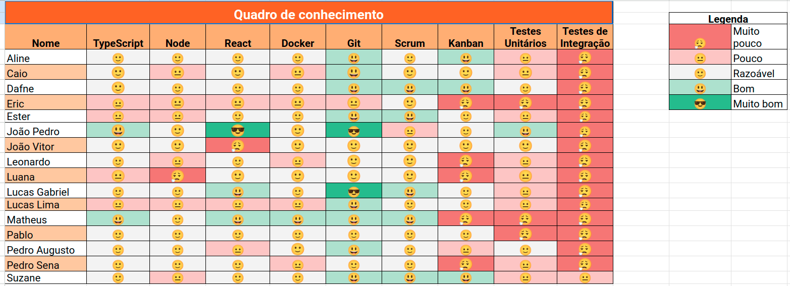
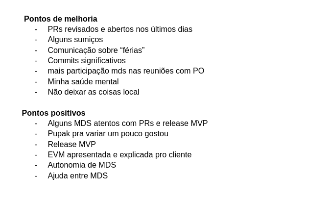

# Sprint 8

- Data de início: 14/06/2023
- Data de término: 21/06/2023

## Objetivos da sprint
* Finalizar os trabalhos não concluídos da sprint anterior
    - US 8, US 11, US 14
* US 21, US 15, US 12
* Aumentar cobertura de testes

## Backlog da Sprint
|**US**|**Responsáveis**|**EPS responsável**|
|--------|-------------|-------------|
| [US 11: Administrador cadastrar usuários](https://github.com/fga-eps-mds/2023-1-alectrion-doc/issues/55)   | Ester, Pablo             | - |
| [US 14: Visualizar perfil de usuário](https://github.com/fga-eps-mds/2023-1-Alectrion-DOC/issues/59)       | Pedro Izarias, Leonardo  | - |
| [US 15: Redefinir senha no primeiro acesso](https://github.com/fga-eps-mds/2023-1-Alectrion-DOC/issues/60) | Pedro Izarias, Leonardo  | - |
| [US 21: Termo de ordem de serviço](https://github.com/fga-eps-mds/2023-1-alectrion-doc/issues/133)         | Suzane, Caio | - |
| [US 12: Alterar senha de login](https://github.com/fga-eps-mds/2023-1-alectrion-doc/issues/57)             | Pedro Sena, Luana        | - |
| [US 08: Cadastrar ordem de serviço](https://github.com/fga-eps-mds/2023-1-alectrion-doc/issues/50) (edição)| Eric, Matheus            | - |

## Outras atividades
|**Atividades**|**Responsáveis**|
|--------|-------------|
Aumentar cobertura de testes | EPS

## *Squads*
|**Squad 1**    |**Squad 2**     |**Squad 3**|
|---------------|----------------|--------------|
| Dafne         | Aline          | Lucas Gabriel
| João Pedro    | Lucas Lima     | Caio
| Luana         | Pablo          | João Vitor
| Pedro Sena    | Ester          | Matheus
| Leonardo      |       -        | Eric
| Pedro Izarias |       -        | Suzane

## Quadro de conhecimento

## Retrospectiva da sprint 8

## Histórico de versão

|**Data**|**Descrição**|**Autor(es)**|
|--------|-------------|--------------|
| 19/06/2023 | Criação do documento | Aline Lermen |
| 29/06/2023 | Adição da retrospectiva e quadro | Aline Lermen |
| 09/07/2023 | Revisão do documento | Dafne Moretti |
