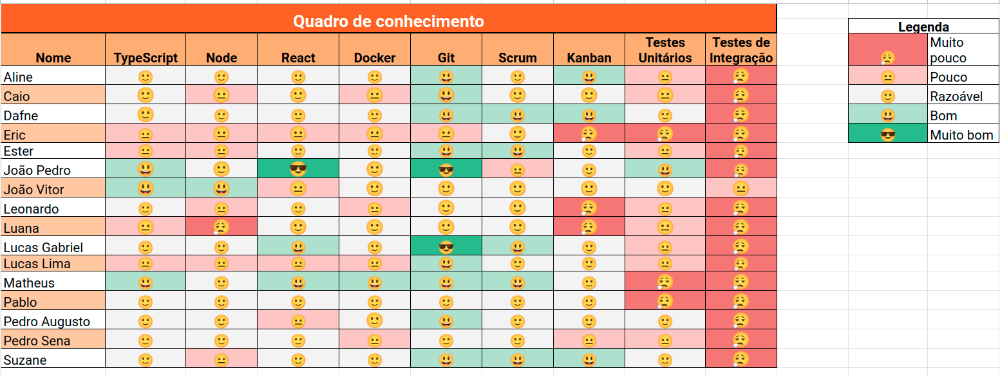
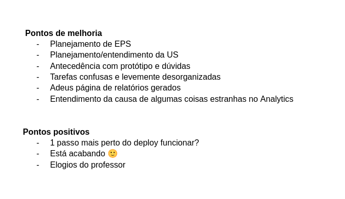

# Sprint 9

- Data de início: 21/06/2023
- Data de término: 28/06/2023

## Objetivos da sprint
* Finalizar o trabalho não concluído da sprint anterior
    - US 21
* US 16, US 17, US 18
* Resolver *bugs*

## Backlog da Sprint
|**US**|**Responsáveis**|**EPS responsável**|
|--------|-------------|-------------|
| [US 21: Termo de ordem de serviço](https://github.com/fga-eps-mds/2023-1-alectrion-doc/issues/133)             | Suzane, Caio | - |
| [US 16: Gerar relatórios de ordem de serviço](https://github.com/fga-eps-mds/2023-1-alectrion-doc/issues/61)   | Matheus, Pedro Izarias | - |
| [US 17: Gerar relatórios de equipamentos](https://github.com/fga-eps-mds/2023-1-Alectrion-DOC/issues/62)       | Leonardo, Pedro Sena, Luana, Pablo  | - |
| [US 18: Gerar relatórios de movimentações](https://github.com/fga-eps-mds/2023-1-Alectrion-DOC/issues/63)      | Ester, Eric  | - |

## Outras atividades
|**Atividades**|**Responsáveis**|
|--------|-------------|
Resolver *bugs* | EPS e MDS

## *Squads*
|**Squad 1**    |**Squad 2**     |**Squad 3**|
|---------------|----------------|--------------|
| Aline         | Dafne          | Lucas Lima
| Lucas Gabriel | João Vitor     | Caio
| Matheus       | Leonardo       | João Pedro
| Pedro Izarias | Pedro Sena     | Ester
|      -        | Pablo          | Eric
|      -        | Luana          | Suzane

## Quadro de conhecimento

## Retrospectiva da sprint 9

## Histórico de versão

|**Data**|**Descrição**|**Autor(es)**|
|--------|-------------|--------------|
| 29/06/2023 | Criação do documento | Aline Lermen |
| 09/07/2023 | Revisão do documento | Dafne Moretti |
